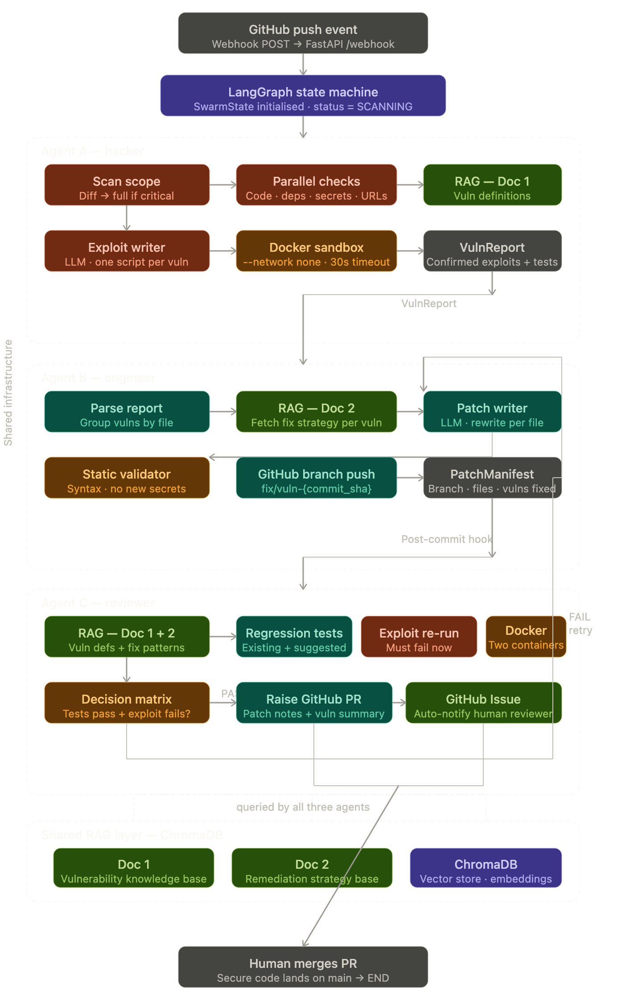

# Vuln-Swarm

> **Core element: GitHub webhook on the testing repository. A webhook is an HTTP callback from GitHub. When code is pushed to the testing repo, GitHub sends a `push` event to `POST /webhook/github`
, and Vuln-Swarm automatically starts a scan for that exact repository, branch, and commit. We use this flow so testing is automatic, tied to real code changes, and ready to create a remediation PR without requiring a manual API call for every run.** 

```bash
https://vuln-swarm-850247898326.asia-south1.run.app/webhook/github
```


Vuln-Swarm is a full-stack, multi-agent security automation system that scans GitHub repositories, validates findings in an isolated Docker sandbox, applies remediation, and re-tests the result before optionally opening a pull request.

## Highlights

- FastAPI backend that runs a cyclic Agent A -> Agent B -> Agent C pipeline with LangGraph
- React dashboard for launching scans and reviewing findings, fixes, validation, and trace data
- Chroma-backed RAG layer seeded from the bundled PDF knowledge base and optional `knowledge/` documents
- Docker-isolated exploit and validation steps with conservative defaults
- GitHub webhook and PR automation for authorized repositories

## Architecture 



## Tech Stack

- Backend: FastAPI, Pydantic v2, LangGraph, ChromaDB, `sentence-transformers`
- Frontend: React 18, Vite, `lucide-react`
- LLM integration: Gemini-compatible structured JSON client
- Automation: Docker sandboxing, GitHub API integration

## Repository Layout

```text
.
├── backend/                 # API, agents, orchestration, storage, tests
├── frontend/                # React dashboard
├── docs/                    # Architecture, API, and security notes
├── scripts/                 # Small local run helpers
├── docker-compose.yml       # Full-stack local environment
├── Vurnabilities .pdf
└── Vurnabilities Solutions.pdf
```

## Prerequisites

- Python 3.11+
- Node.js 18+
- Docker
- A Gemini API key if you want LLM-assisted remediation
- A GitHub token if you want forking or PR creation

## Environment Setup

Create a local env file from the template:

```bash
cp .env.example .env
```

Most important variables:

- `GEMINI_API_KEY`: enables Gemini-backed structured agent responses
- `GITHUB_TOKEN`: required for fork and PR automation
- `VULN_SWARM_DATA_DIR`: overrides where runs and Chroma data are stored
- `FRONTEND_ORIGIN`: frontend URL allowed by the backend CORS config

## Webhook Setup For The Testing Repo

`/webhook/github` is the main automation entrypoint for repository-triggered scans.

What a webhook is:

- A webhook is a GitHub feature that sends an HTTP request to our backend when an event happens in a repository.
- In this project, the backend accepts GitHub `push` and `ping` events at `POST /webhook/github`.

How to configure it in the testing repository:

1. Start the backend and make it reachable from GitHub.
2. In the testing repository on GitHub, open `Settings -> Webhooks -> Add webhook`.
3. Set the `Payload URL` to your public backend URL, for example `https://your-domain.com/webhook/github`.
4. Set `Content type` to `application/json`.
5. Choose `Just the push event`.
6. Save the webhook and use the `ping` test from GitHub if needed.
7. Make sure `GITHUB_TOKEN` is configured in this project so the automation can push fixes or open a PR after validation.

Why we use it:

- It automatically starts a scan whenever the testing repo receives a new push.
- It passes the real repository name, branch, and commit SHA from GitHub, so the scan runs against the exact change that triggered it.
- It removes the need to manually call `/scan-repo` for each test run.
- It supports the end-to-end workflow where Vuln-Swarm can scan, patch, validate, and then create a pull request automatically.

Notes:

- GitHub must be able to reach the backend URL, so localhost-only URLs need a tunnel or deployed backend.
- The current backend implementation supports `push` and `ping` events only.
- The webhook path is handled in [backend/vuln_swarm/api/app.py](/Users/shreyashgolhani/Desktop/G-Pilot/backend/vuln_swarm/api/app.py:67).

## Local Development

Start the backend:

```bash
cd backend
python -m venv .venv
source .venv/bin/activate
pip install -e ".[dev]"
uvicorn vuln_swarm.api.app:app --reload --port 8000
```

Start the frontend in another terminal:

```bash
cd frontend
npm install
npm run dev
```

Open `http://localhost:5173`.

You can also use the helper scripts:

```bash
./scripts/run_backend.sh
./scripts/run_frontend.sh
```

## Docker Compose

To run the full stack with Docker:

```bash
docker compose up --build
```

The compose setup exposes:

- frontend at `http://localhost:5173`
- backend at `http://localhost:8000`

## API Overview

- `GET /health`: simple service health check
- `POST /scan-repo`: enqueue a GitHub repository scan
- `POST /webhook/github`: accept GitHub `push` and `ping` events
- `GET /status/{job_id}`: inspect pipeline status and trace events
- `GET /report/{job_id}`: fetch the structured scan, fix, and validation reports
- `POST /retry/{job_id}`: retry a completed or failed job
- `GET /knowledge/stats`: inspect Chroma collection counts

Example scan request:

```bash
curl -X POST http://localhost:8000/scan-repo \
  -H "Content-Type: application/json" \
  -d '{
    "github_repository": "owner/repo",
    "branch": "main",
    "base_branch": "main",
    "create_pr": false
  }'
```

## Knowledge Base

By default, the backend looks for the bundled PDFs below plus an optional `knowledge/` directory:

- `Vurnabilities .pdf`
- `Vurnabilities Solutions.pdf`

To rebuild the knowledge base manually:

```bash
cd backend
python -m vuln_swarm.rag.ingest --force
```

## Security Notes

- Repository analysis and validation run inside Docker with networking disabled by default
- Validation containers use resource limits and `no-new-privileges`
- PR automation only runs when `create_pr=true` and `GITHUB_TOKEN` is configured
- Secret-related findings may still require rotation and history rewrite even after patching

## Documentation

- [Architecture](docs/architecture.md)
- [API examples](docs/api.md)
- [Security model](docs/security_model.md)
