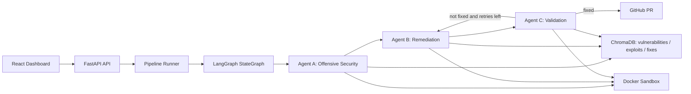

# Architecture



## Shared State

```json
{
  "vulnerabilities": [],
  "fixes": [],
  "validation_status": "pending",
  "retry_count": 0
}
```

The graph is cyclic:

`START -> Agent A -> Agent B -> Agent C -> END`

If Agent C rejects the fix and `retry_count < max_retry_count`, control loops back to Agent B with structured feedback.
